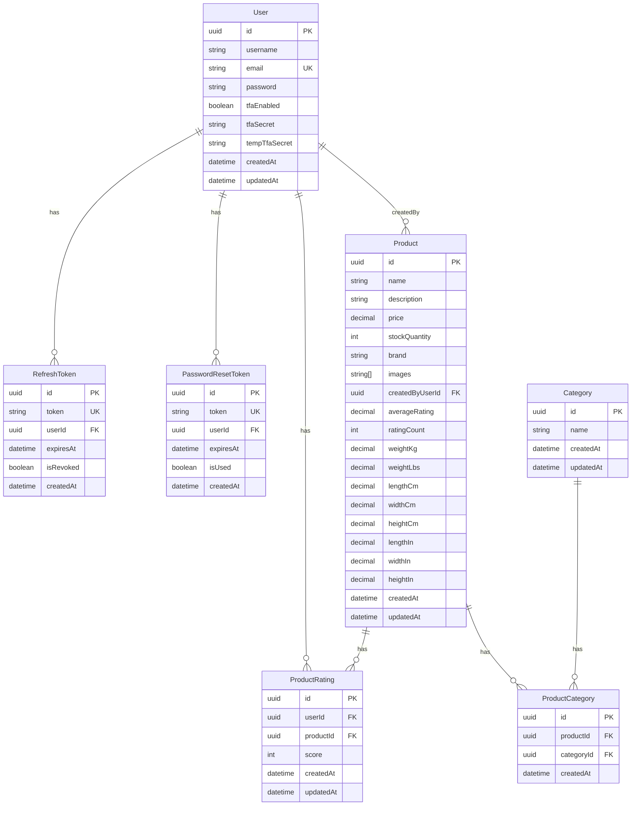

# Dot-com Retail — B2C E-commerce Platform

A Business-to-Consumer e-commerce backend and frontend: user auth (email/password, Google OAuth, 2FA), product catalog with search and facets, product ratings (1–5 stars), and product management (create/edit/delete by creator). Built with Node.js, Express, Prisma, PostgreSQL; frontend is static HTML/JS served by the backend.

---

## Project overview

- **Backend**: Express API — registration (with reCAPTCHA), login, JWT access/refresh (rotation, revocation), Google OAuth, password reset via email, optional TOTP 2FA; product list/search/facets/suggest and CRUD; product ratings (POST/DELETE rate); image uploads.
- **Frontend**: Static pages — API tester (`test.html`) and products browser (`products.html`). Browse products, filter, sort (including by rating), and rate when logged in. Access token is kept in memory only; refresh token may be stored for session recovery after reload.
- **Database**: PostgreSQL with Prisma; ACID-compliant; migrations in `backend/prisma/migrations`.

---

## Entity Relationship Diagram



- **Entities**: User, Product, Category, ProductCategory (join), ProductRating, RefreshToken, PasswordResetToken.
- **Primary keys**: `id` (UUID) on each table.
- **Foreign keys**: Product.createdByUserId → User; ProductCategory → Product, Category; ProductRating → User, Product; RefreshToken/PasswordResetToken → User.
- **Cardinality**: User 1:N RefreshToken, 1:N PasswordResetToken, 1:N Product, 1:N ProductRating; Product N:M Category via ProductCategory, 1:N ProductRating.
- **Modality**: Product.createdByUserId optional (nullable); others required where indicated. One rating per user per product (unique on userId + productId).

---

## Setup and installation

### Option 1: Docker (recommended — only prerequisite is Docker)

1. Clone the repo and go to the project root (e.g. `cd i-love-shopping1`).
2. First-time / reviewers: copy env example and set secrets:
   ```bash
   cp backend/.env.example backend/.env
   ```
   Edit `backend/.env` if you need real values for reCAPTCHA, Google OAuth, or SMTP.
3. Start the stack:
   ```bash
   docker compose up -d
   ```
4. Backend and Postgres start; backend runs migrations. App: **http://localhost:3000** (e.g. `test.html`, `products.html`). The frontend is mounted from your repo, so HTML/JS changes apply without rebuilding. After changing **backend** code or adding API routes, rebuild and recreate: `docker compose build backend && docker compose up -d --force-recreate backend`.

**Keeping your data:** The database and uploads live in **named Docker volumes**. Data persists across `docker compose down` and `docker compose up -d`. To **avoid losing data**, do **not** use `docker compose down -v`: the `-v` flag removes volumes and clears the DB and uploads. Use `docker compose down` (without `-v`) when you want to stop the stack but keep data.

**Sample data (products with images and ratings):** If the repo includes `backend/seed-data/export.json` and `backend/seed-data/uploads/`, load sample products and images after the first run:
- **Docker:** `docker compose exec backend npx prisma db seed`
- **Local:** `cd backend && npx prisma db seed`
Seeded users all have password **Demo123!**. If the seed fails with a missing Prisma client error, run `docker compose exec backend npx prisma generate` then try the seed again (or rebuild: `docker compose build backend --no-cache && docker compose up -d --force-recreate backend`).
  ```
Commit the created `backend/seed-data/` folder (including `uploads/`) so reviewers get products and images.

### Option 2: Local (Node + PostgreSQL)

1. Install Node 20+ and PostgreSQL. Create a database and set `DATABASE_URL` in `backend/.env` (or copy from `backend/.env.example`).
2. Backend:
   ```bash
   cd backend
   npm install
   npx prisma generate
   npx prisma migrate deploy
   npm run dev
   ```
3. Server runs at **http://localhost:3000**; open `test.html` or `products.html` in the browser.

---

## Usage guide

- **API tester** (`/test.html`): Health check, register (with reCAPTCHA), login, logout, Google OAuth, refresh token, get current user, products, forgot/reset password, 2FA setup and verify.
- **Products page** (`/products.html`): Browse and filter products (search, brand, category, price range, sort by price/rating/name/relevance); view and submit **ratings** (1–5 stars) when logged in; create/edit/delete products when logged in (creator only). Use **http://localhost:3000/products.html**; if ratings or sort options don’t appear, hard refresh (Ctrl+F5 or Cmd+Shift+R).
- **Access token**: Stored in memory only (not in localStorage). After a full page reload, the app uses the refresh token (if stored) to obtain a new access token automatically where implemented (tester and products page).

### Running tests

```bash
cd backend
npm test
```

- Unit: JWT generation/validation, product helpers (category name, query parsing, where builder).
- API: Health, auth (login/me), products (list, suggest, facets).
- Security: Malformed body, 401 on protected routes. (Rating API is covered by the same auth patterns.)

Optional ACID demo:

```bash
cd backend
npx tsx scripts/test-acid.ts
```

---

## Compliance and review

See **REVIEW.md** for a checklist against the assignment (auth, DB, product catalog, ratings, tests, Docker).
